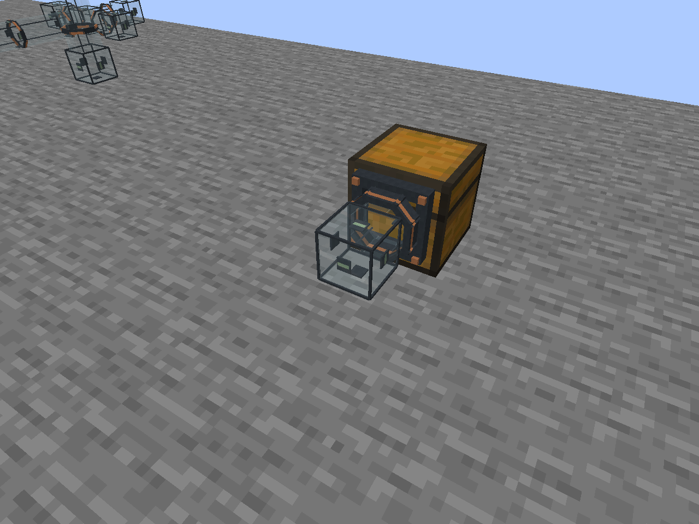

# HomeLink Storage 1.4.0

**Storage Pipes / Tuyaux de stockage** : transport physique d'objets dans des tubes
transparents, utilisables **sans Controller et sans coût HE**. Réglez chaque raccord en
entrée ou sortie du contenant, choisissez plusieurs types d'objets dans les filtres,
et ajoutez éventuellement un Controller pour la supervision/récupération.

English: physical item transport inside transparent pipes, with per-face direction,
multi-item filters and standalone operation without HE. A Controller is optional
for managed energy, supervision and recovery. Included in this
mod; no extra Router or Logistics JAR.

- [Guide FR/EN et recette](docs/STORAGE_PIPES.md)
- [Architecture et conservation](docs/STORAGE_PIPES_ARCHITECTURE.md)
- [Validations réellement exécutées](docs/PIPES_VALIDATION.md)
- [Changelog 1.4.0](CHANGELOG.md)

Minecraft 1.21.1 · NeoForge 21.1.251 · Java 21.

Les tuyaux ont une section octogonale en verre, des colliers graphite/cuivre et
un raccord 3D à bride et quatre boulons au contact des contenants.



[Voir des cargaisons pendant leur trajet réel](docs/images/storage-pipe-transit.png).

HomeLink Storage connecte, indexe, recherche, localise et surveille de vrais
inventaires Minecraft. Chaque bloc a un rôle distinct :

- **Terminal** : seul bloc qui affiche les objets et permet de les retirer ;
- **Controller** : son écran principal gère le réseau (nom, inventaires, zones,
  oubli des inventaires hors ligne, actualisation) ; sa vue Pipes supervise
  les circuits et permet la récupération des cargaisons bloquées ;
- **Link** (Connecteur) et **Repeater** : pas d’écran, un clic droit affiche leur état
  et dessine pendant 30 s leur zone d’action (leur chunk) et celles du reste du réseau ;
- **Deposit** : écran limité à ses 27 emplacements d’entrée ;
- **Coffre de débordement** : reçoit après 5 s les objets qu’aucun coffre ne contient
  encore ; ce qui ne peut aller nulle part reste « en attente » et se reprend depuis le Terminal.
- **Storage Pipe** : transporte des objets entre contenants physiquement reliés,
  avec sens et filtre indépendants sur chaque face.

## Installation et prise en main

Le [Storage Deposit](docs/STORAGE_DEPOSIT.md) ajoute un coffre d'entrée de 27 slots :
une stack par seconde est rangée dans un inventaire connecté contenant déjà la même
variante. Il se relie au Controller avec la clé USB de liaison existante.

Installer `homelink_storage-1.4.0.jar`, `homecore-1.13.0.jar` et `homelink_energy-0.5.0.jar` dans le dossier
`mods` du client et du serveur NeoForge.

### Transport par tuyaux

1. Fabriquer 8 Storage Pipes avec 6 lingots de cuivre, 2 blocs de verre et 1 redstone.
2. Poser une conduite continue entre deux contenants compatibles ; les raccords
   apparaissent automatiquement, sans outil de liaison.
3. Cliquer à main vide sur le raccord source, choisir **SORTIE : COFFRE → TUYAU**,
   puis appliquer. Sur la destination, choisir **ENTRÉE : TUYAU → COFFRE**, puis appliquer.
4. Configurer éventuellement les filtres : BLACKLIST vide autorise tout,
   WHITELIST vide bloque tout. Les filtres des deux raccords s'appliquent.

En mode autonome, les deux raccords doivent être validés par le même propriétaire.
Le Controller est optionnel et aucun HE n'est consommé sans lui. Par défaut, un
départ transporte jusqu'à 16 objets toutes les 20 ticks, avec 8 ticks de trajet
par segment ; les objets arrivent après le voyage visible dans le verre.
Un coffre relié par pipe n'entre pas automatiquement dans l'index des Links.

### Stockage indexé et Terminal

1. Placer un Storage Controller.
2. Placer un Storage Link dans le chunk à couvrir : il découvre les inventaires
   accessibles de tout ce chunk.
3. Pour couvrir plus loin, placer un Storage Repeater dans un chunk cardinal voisin,
   puis prolonger la chaîne de chunk en chunk.
4. Main vide et accroupi, cliquer sur le Controller, puis sur les Links, Repeaters
   et le Terminal à lui associer.
5. Ouvrir le Terminal normalement. Le bouton `?` affiche le manuel intégré.

Le Controller peut se poser sur toute face d’un bloc. Son voyant clignote lorsque
des inventaires sont connectés. Dans la grille du Terminal, double-clic ou Maj+clic retire une stack,
clic droit une demi-stack, Ctrl+clic un objet et clic molette remplit l’inventaire ; le
champ Quantité retire un nombre libre. Les objets viennent de n’importe quel coffre du
réseau. La permission HomeCore CONTROL est nécessaire. JEI (19+) et REI (16+) sont pris en charge en option :
R/U sur la grille, recherche synchronisée, récupération des ingrédients d’une recette et une page d’information pour chaque objet du mod.

Le Terminal possède deux modèles : sur pied lorsqu’il est posé sur le dessus d’un
bloc, et panneau mince lorsqu’il est fixé à un mur ou sous un bloc.

Les nœuds ne chargent jamais un chunk de force. Un répéteur diagonal ou séparé de la
chaîne reste hors ligne. Le guide détaillé explique aussi la recherche, la localisation,
les zones et les permissions HomeCore.

- [Guide utilisateur](docs/USER_GUIDE.md)
- [Recettes](docs/RECIPES.md)
- [Architecture et développement](docs/DEVELOPMENT.md)
- [Contrat réel HomeCore](docs/HOMECORE.md)
- [Vérifications exécutées](docs/VALIDATION.md)
- [Fichiers du projet](docs/FILES.md)

## Construire

Installer un JDK 21, définir `JAVA_HOME`, puis utiliser le wrapper Gradle :

```powershell
git clone https://github.com/LKDM7/HomeCore ../HomeCore
git clone https://github.com/LKDM7/HomeLink-Energy ../HomeLinkEnergy
.\gradlew.bat -PuseLocalDependencies=true build
.\gradlew.bat releaseBundle
.\gradlew.bat runClient
```

L’emplacement de HomeCore est configurable avec
`-Phomecore_dir=../autre-checkout`. Avec `-PuseLocalDependencies=true`, le composite Gradle compile la vraie API
HomeCore 1.13.0 sans embarquer ses classes dans Storage. HomeLink Dashboard n’est pas
une dépendance : Storage reprend son langage visuel et expose ses données au Dashboard
uniquement au travers de HomeCore.

## Vérification

```powershell
.\gradlew.bat build test
.\gradlew.bat runSmoke -PsmokeLanguage=fr_fr
.\gradlew.bat runSmoke -PwithDashboard -PsmokeLanguage=fr_fr --no-configuration-cache
.\gradlew.bat runSmoke -PwithJei -PsmokeLanguage=fr_fr
.\gradlew.bat runPersistence -PpersistencePass=write
.\gradlew.bat runPersistence -PpersistencePass=read
```

`runSmoke` démarre un vrai client Minecraft et un serveur intégré, exécute les
scénarios, prend des captures puis ferme le jeu. Les tests de persistance utilisent
deux processus serveur et le même monde. Les validations sont exclues du JAR distribué.

Les appareils de stockage possèdent des géométries 3D distinctes, construites avec
des matériaux vanilla pour rester compatibles avec les packs de ressources. Les Storage Pipes
disposent de leurs propres textures de verre, graphite et cuivre, avec une section
octogonale et des colliers fins. Un raccord 3D à bride, manchon cuivre et quatre
boulons apparaît au contact d'un contenant. Le métal opaque et le verre translucide
utilisent des couches de rendu séparées. Les inventaires moddés passent par la capability
standard NeoForge ; chaque mod tiers n’a pas été testé
individuellement. Le test optionnel Dashboard utilise le vrai checkout voisin
`../HomeLink` (configurable avec `-Pdashboard_dir`).

Licence Apache-2.0, auteur LKDM.
